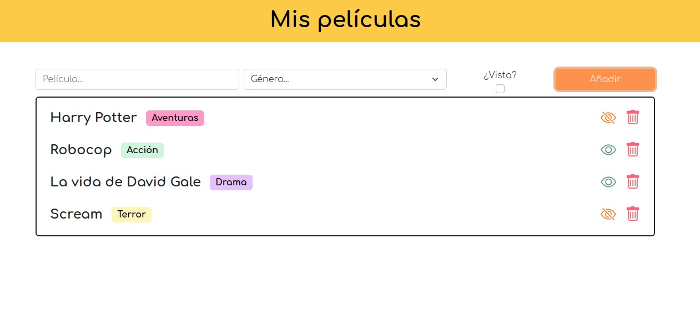

# ==Receta:== Movies App - v.1.0

## 0.- Nuestra "base de datos" será un ==array de objetos== como el siguiente

```javascript
const allMovies = [
    {
        id: 1,
        title: 'Harry Potter',
        genre: 'Aventuras',
        isSeen: false
    }
]
```


## 1.- Inicio del proyecto

Instalaremos ==bootstrap== y usaremos también ==bootstrap-icons==  (recuerda el `npm init -y`)

* Creamos archivo `.scss` e importamos bootstrap vigilando que esté bién la ruta en tu árbol de carpetas.

  ```scss
  @import '../../../node_modules/bootstrap/scss/bootstrap.scss';
  ```

* Cambiamos las variables que queramos **antes de esa línea** para poder tener otros colores principales.

* Importamos la fuente de iconos de bootstrap dentro del `<head>`.

  

## 2.- Creación del markup con HTML



## 3.- Primeros pasos en JS

* Cazar todo lo necesario (formulario, caja de películas)
* añadir listener del submit
* evitar comportamiento por defecto del formulario
* guardar valores que me ha puesto el usuario
* revisar que no haya dejado ningún campo vacío
  * Marcar de alguna forma visible que hay un error.

* una vez todo ok, guardamos esa nueva película en el array como un objeto nuevo

## 4.- Imprimir las películas en pantalla

* Creamos una función externa `printMovies()`que se encargará de recorrer la base de datos y por cada película que haya en el array: 
  * RECUERDA PRIMERO BORRAR LAS QUE HAY `movieList.innerHTML = ''`
  * Crearemos un nuevo elemento del dom que contendrá el markup de la película.
    * Es recomendable que sea otra función aparte la que se encargue de hacer eso, por ejemplo `createMovie()`, pero si no queréis lo podéis hacer todo junto.
  * los imprimirá en el DOM

* Esta función `printMovies()` será la encargada de imprimir todas las películas cada vez que haya un cambio en la base de datos.
* ¡EXTRA! Como véis en la foto cada género sale con un color distinti. Podemos crear una función que seleccionará el color de la etiqueta de Género `selectColorForGenre(genre)` y retornará una clase CSS dependiendo del género que sea. 

## 5.- Cambiar una película de VISTA/NO VISTA

* Escuchar el botón de vista, y ejecutar una función NUEVA que haga el cambio
* Para saber qué película es a la que le hemos hecho click, podemos:
  * Pasarle a esa función el ID de la película. Eso lo podríamos hacer si le hemos añadido un "listener" al botón del ojo en el mismo sitio donde hemos creado el markup de la película.
  * También podemos durante la creación del markup añadirle a la película en algún atributo como por ejemplo `data-id=""` el id de cada una. Y a la hora de hacer click al botón mirar qué ID tiene guardado y modificar solo esa película.

* Teniendo el ID ya sea de una forma o de otra, buscamos en el array la película a la que hemos hecho click  y le cambiamos la propiedad `isSeen` por el inverso de lo que tenga.
  * Podemos cambiarlo directamente recorriendo el array con un `for`, `forEach`, etc y cambiando la que coincida
  * Podemos usar un `.find()` para encontrar el objeto y cambiarle su propiedad `isSeen`
* Volvemos a imprimir las películas ya que ahora la "base de datos ha cambiado".

## 6.- Eliminar una película

* Escuchar el botón de papelera, y ejecutar una función que borre el elemento
* Tendremos que pasarle a esa función el ID de la película para saber cual cambiar
* Buscamos en el array la película a la que hemos hecho click y lo eliminamos del array
  * Podemos hacer un splice *(mutamos el array)*
  * Podemos conseguir un nuevo array que tenga las mismas películas excepto la que has hecho click *(cambio de referencia)* `filter()`
* Volvemos a imprimir las películas.

## 7.- ¡EXTRA! Implementamos una alerta de error

Podemos crear, si no lo hemos hecho ya, una alerta que salga para mostrar el error. Ya que estamos utilizando Bootstrap, podemos utilizar el componente  ==Alert== que aporta unos estilos fáciles para crear esa pequeña tarjeta que sale cuando hay un error.

* Creamos una función que cree el markup de un ==alert== y la meta en el body
* Con estilos la ponemos donde queremos y le añadimos animaciones
* Hay que acordarse de borrar esa alert del `DOM` pasado un tiempo
  * Si tiene una animación podemos escuchar el evento `'animationend'` y luego hacer el remove


